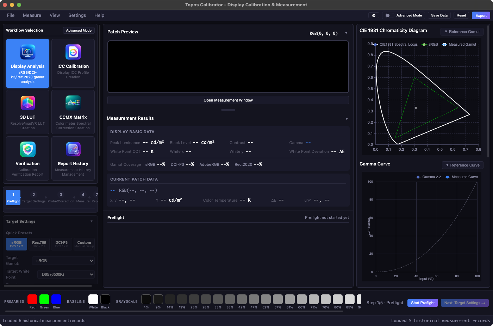

# Topos Calibrator

Professional display calibration and measurement software.

[English](README.md) | [简体中文](README.zh-CN.md)

<p align="center">
  
</p>

<p align="center">
  
</p>

The screenshot above shows the main workflow, patch preview, live charts, measurement
results, and environment preflight in one view.

Topos Calibrator is a display calibration and measurement tool for photography,
video production, and professional color workflows. It covers the full path
from gamut and Gamma checks to ICC profiles, 3D LUTs, and validation reports.

Current release: **v0.1.0-preview**

## Features

### Core capabilities

- **Multiple colorimeters and spectroradiometers** — i1 Display Pro, i1 Pro 2/3, SpyderX/Spyder5, ColorMunki, and other supported instruments.
- **Gamut measurement** — Measure RGBW primaries and calculate gamut coverage.
- **Gamma measurement** — Measure grayscale patches and calculate Gamma curves.
- **Closed-loop AutoCal** — Control monitor OSD settings through DDC/CI: baseline measurement → RGB gain/brightness solving → write → verify, with up to five iterations, dry-run mode, snapshots, rollback, and manual adjustment guidance.
- **Saturation and hue sweeps** — Six hues × four saturation levels plus a 12-step hue sweep, with tracking charts.
- **HDR EOTF tracking** — Validate PQ (ST 2084) and HLG grayscale values in nits and report point-by-point errors using ΔE ITP (BT.2124).
- **Uniformity checks** — 3×3 or 5×5 grids with automatic patch positioning, luminance uniformity, center-relative heatmaps, and Δu'v' chromaticity deviation. Guided point-by-point confirmation is supported and results are included in PDF reports.
- **Measurement quality controls** — Configurable repeats for XYZ averaging, adaptive low-light sampling, and patch delays.
- **Multi-monitor support** — Enumerate displays and populate ICC/AutoCal target choices using the same numbering as ArgyllCMS (`dispwin`/`dispcal -d`).
- **History and trend analysis** — Track white point, luminance, CCT, and Gamma over time by display and target.
- **Built-in spectral correction library** — Bundled CCSS/CCMX corrections for DTP94, i1 Display, Spyder, Huey, and related instruments. Custom CCMX files and X-Rite `.edr` imports are supported.
- **Dark-room appearance and font scaling** — Reduce background brightness for dark environments and switch between standard, large, and extra-large UI text.
- **Color analysis** — Delta E (CIE76/94/2000 and HDR ΔE ITP), CCT, Duv, white-point error, and related professional metrics.
- **Live charts** — CIE 1931 chromaticity, Gamma, saturation tracking, and CCT/Duv tracking charts.
- **Data export** — JSON sessions, ArgyllCMS-compatible TI3 files, PDF reports, and `.cube` / `.3dl` / `.mga` / `.clf` 3D LUT formats.

### Supported color spaces

| Category | Color spaces |
|----------|--------------|
| Basic | sRGB, Rec.709 |
| Wide gamut | DCI-P3, Display P3, Adobe RGB, Rec.2020 |
| Professional | ProPhoto RGB, Cinema Gamut, ACES AP0, ACES AP1 |
| Camera/brand | S-Gamut3, S-Gamut3.Cine, V-Gamut, C-Gamut, RED Wide Gamut |

### Supported Gamma and EOTF standards

- **Standard Gamma:** 1.8, 2.0, 2.2, 2.4, 2.6
- **Composite curves:** sRGB, BT.1886, Rec.709
- **HDR curves:** PQ (ST 2084), HLG
- **Log curves:** LogC, S-Log3, V-Log, C-Log, RED Log, ACEScct

## Requirements

- **Operating systems:** macOS, Windows, or Linux
- **Python:** 3.10+
- **Colorimeter/spectroradiometer:** A supported measurement instrument
- **ArgyllCMS:** Required. At minimum the project needs `spotread`; full calibration, ICC, and LUT workflows also use `dispcal`, `targen`, `colprof`, `collink`, and `dispwin`.

## Installation

### 1. Clone the project

```bash
git clone https://github.com/ToposHub/topos-calibrator.git
cd topos-calibrator
```

### 2. Install Python dependencies

```bash
pip install -r requirements.txt
```

### 3. Install ArgyllCMS (required)

Download the release for your operating system from the
[ArgyllCMS website](https://www.argyllcms.com/). For a portable project setup,
place it in the project root using this exact layout. The folder name must be
exactly `ArgyllCMS` (including capitalization):

```text
topos-calibrator/
├── ArgyllCMS/
│   ├── bin/
│   │   ├── spotread       # macOS/Linux
│   │   ├── dispcal
│   │   ├── targen
│   │   ├── colprof
│   │   ├── collink
│   │   ├── dispwin
│   │   └── spotread.exe   # Windows uses the .exe binaries
│   └── ref/               # Official reference files from ArgyllCMS
└── ...
```

Important placement rules:

1. Extract the downloaded archive in the project root and rename the final folder to **`ArgyllCMS`**.
2. `bin` must be a direct child of `ArgyllCMS`: `./ArgyllCMS/bin/spotread` on macOS/Linux or `./ArgyllCMS/bin/spotread.exe` on Windows.
3. Do not leave an extra release folder in the path, such as `ArgyllCMS/Argyll_Vx.y.z/bin`, `./bin`, or `ArgyllCMS/ArgyllCMS/bin`.
4. If macOS/Linux blocks execution, run `chmod +x ArgyllCMS/bin/*`. Windows does not need this step.

Verify the installation:

```bash
# macOS/Linux
./ArgyllCMS/bin/spotread -?

# Windows PowerShell
.\ArgyllCMS\bin\spotread.exe -?
```

macOS users can alternatively install ArgyllCMS with `brew install argyll-cms`,
and Debian/Ubuntu users can use `sudo apt install argyll`. The project-local
`ArgyllCMS/bin` layout is still recommended for reproducible setups across
machines. `ArgyllCMS/` is included in `.gitignore`; do not commit third-party
binaries to GitHub.

### 4. Build a distributable app with ArgyllCMS

The repository does not contain ArgyllCMS binaries. To build a portable macOS
or Windows package, download the matching official binary archive and the
matching source archive from the [ArgyllCMS download page](https://www.argyllcms.com/),
extract the binary archive as `./ArgyllCMS/`, and keep `bin/` as its direct
child. Then run the build on the target operating system:

```bash
# macOS .app
python scripts/build_all.py --platform macos --clean \
  --argyll-source /path/to/Argyll_V3.5.0_source.zip

# Windows directory + NSIS installer (.exe)
python scripts/build_all.py --platform windows --clean \
  --argyll-source C:\path\to\Argyll_V3.5.0_source.zip
```

The build helper copies the official license files into
`ArgyllCMS/licenses/`, records the binary version and SHA-256 values, and
includes the corresponding source archive in the package. It also includes
Topos Calibrator's `LICENSE` and `licenses/THIRD_PARTY_NOTICES.md`. A
distributable build fails when `ArgyllCMS/` is present but the matching source
archive was not supplied. This keeps the AGPL-3.0 source and notice
requirements visible to end users. See [`packaging/README.md`](packaging/README.md)
for the complete checklist.

## Usage

### One-command automatic calibration

Place the instrument at the **center of the display**, then run:

```bash
python scripts/auto_calibrate.py
```

The workflow connects to the instrument, displays full-screen patches, exports
TI3 data, generates an ICC profile, and installs it for the active display.

- The screen displays a sequence of solid-color patches for approximately 2–5 minutes; do not move the instrument.
- On macOS, the script uses `caffeinate` to prevent sleep and must run inside a graphical session (not over SSH).
- The generated ICC profile is registered with the system and can be reviewed in the display settings.

Common options:

```bash
python scripts/auto_calibrate.py --grid 5          # Denser 5×5 sampling grid
python scripts/auto_calibrate.py --quality h       # High-quality colprof mode
python scripts/auto_calibrate.py --no-install      # Generate an ICC without installing it
python scripts/auto_calibrate.py --skip-measure --ti3 path/to/measurement.ti3
python scripts/auto_calibrate.py --dry-run         # Show the patch list without measuring
```

### Graphical interface

```bash
python main.py
```

The UI provides two modes. **Guided mode** (the default) walks through
preflight → target setup → instrument/correction → measurement → generation →
validation → report. **Advanced mode** exposes the free-form settings and
measurement controls for experienced users and debugging.

Basic workflow:

1. Connect the instrument and select the instrument/display type.
2. Calibrate the instrument on its white reference tile when prompted.
3. Choose a measurement mode: display detection, ICC creation, 3D LUT creation, or custom color.
4. Start single-patch or continuous measurement.
5. Review the CIE chart and Gamma curve.
6. Save JSON or TI3 measurement data.

In a multi-monitor setup, the patch window defaults to the secondary display
while the main control window stays available on the primary display.

## Project structure

```text
topos-calibrator/
├── main.py                    # Application entry point
├── requirements.txt           # Runtime dependencies
├── README.md                  # English documentation (default)
├── README.zh-CN.md            # Simplified Chinese documentation
├── measurements/              # Saved measurement sessions
│   └── *.json
├── ArgyllCMS/                 # Local ArgyllCMS installation (ignored by Git)
│   └── bin/                   # spotread and other executables
├── resources/app-icons/       # Application icons and README wordmark
│   ├── topos-calibrator.png
│   └── topos-calibrator-logo.png
├── docs/screenshots/          # README interface screenshots
│   ├── topos-calibrator-main-ui-en.png
│   └── topos-calibrator-main-ui.png
├── src/                       # Python backend modules
│   ├── main_window.py         # PyQt6 main window
│   ├── backend.py             # QWebChannel backend
│   ├── argyll_controller.py   # ArgyllCMS controller
│   ├── patch_window.py        # Measurement patch window
│   ├── data_storage.py        # Measurement storage
│   └── measurement_analyzer.py
├── scripts/                   # Utility scripts
│   └── auto_calibrate.py      # Automatic calibration workflow
└── web/                       # HTML/CSS/JavaScript frontend
```

## Technical architecture

- **Frontend:** HTML, CSS, JavaScript, and ECharts
- **Backend:** Python and PyQt6
- **Communication:** QWebChannel (Python ↔ JavaScript)
- **Rendering:** QWebEngineView (Chromium)
- **Measurement:** ArgyllCMS `spotread` and related tools

## Measurement data formats

JSON sessions contain metadata, instrument details, target settings, and
measurement results. Exported TI3 files are compatible with ArgyllCMS and can
be used to create an ICC profile:

```bash
colprof -v -q m -t -p -D "MyDisplay" measurement.ti3
```

## Supported instruments

| Instrument | Code | Recommended delay |
|------------|------|-------------------|
| X-Rite i1 Display Pro/Studio | `i1d3` | 250 ms |
| X-Rite i1 Pro 2 | `i1pro2` | 400 ms |
| X-Rite i1 Pro 3 | `i1pro3` | 400 ms |
| Datacolor SpyderX | `spyderx` | 250 ms |
| Datacolor Spyder5 | `spyder5` | 500 ms |
| X-Rite ColorMunki | `cm` | 500 ms |

## Display technologies

- **LCD**
- **OLED**
- **Plasma**
- **Projector** (use a longer measurement delay)

## Use cases

- Professional display calibration
- Gamut coverage evaluation
- Gamma behavior analysis
- ICC profile and LUT creation
- DCI-P3, Rec.2020, and ACES production workflows

## License

[GNU General Public License v3.0](LICENSE) (GPL-3.0)

## Acknowledgements

- [ArgyllCMS](https://www.argyllcms.com/) — open-source color management system
- [ECharts](https://echarts.apache.org/) — Apache-licensed charting library
- [PyQt6](https://www.riverbankcomputing.com/software/pyqt/) — Python Qt bindings
