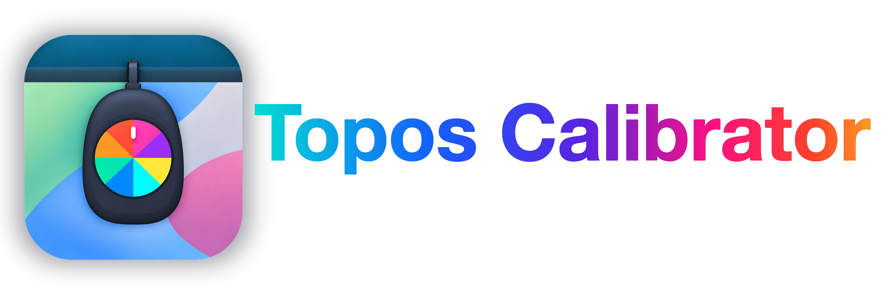
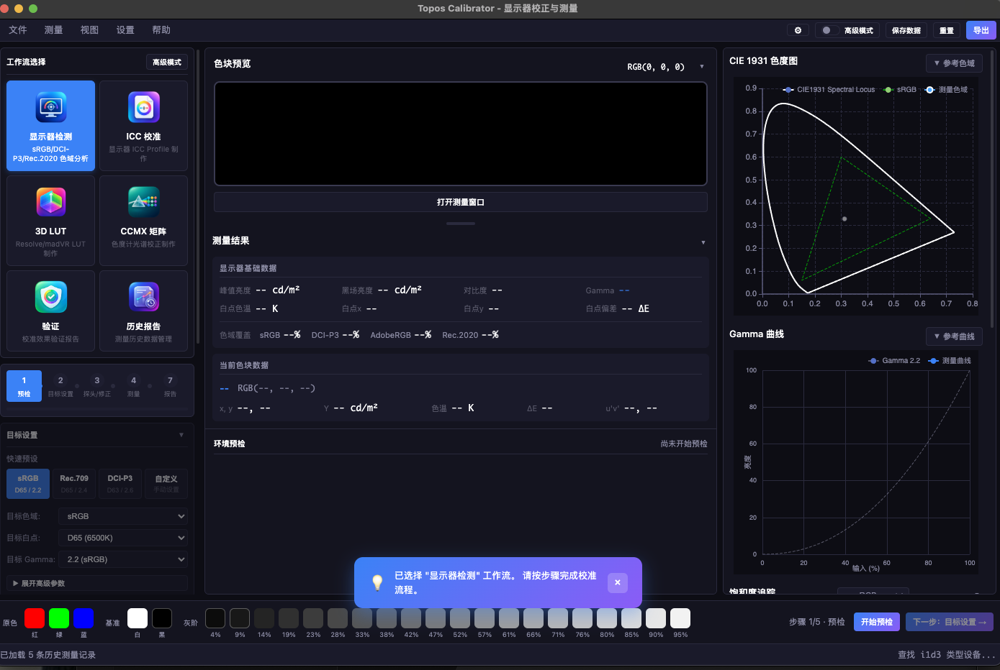

# Topos Calibrator

专业显示器校正与测量软件

[English](README.md) | 简体中文

<p align="center">
  
</p>

<p align="center">
  
</p>

上方截图展示了主工作流、色块预览、实时图表、测量结果和环境预检状态，
用户无需启动程序即可快速了解软件界面。

Topos Calibrator 是一款面向摄影、视频制作和专业显示器工作流的显示器校正与测量工具，
提供从色域/Gamma 检测到 ICC Profile、3D LUT 和验证报告的完整流程。

当前版本：**v0.1.0-preview**

## 功能特性

### 核心功能

- **多探头支持** - 支持 i1 Display Pro、i1 Pro 2/3、SpyderX/Spyder5、ColorMunki 等主流校色仪
- **色域测量** - 测量显示器 RGBW 原色，计算色域覆盖率
- **Gamma 测量** - 灰阶测量，计算 Gamma 值和曲线
- **自动校准闭环 (AutoCal)** - 通过 DDC/CI 直控显示器 OSD：基线测量 → 求解 RGB 增益/亮度 → 写入 → 验证，最多迭代 5 轮直到白点/亮度达标；支持演练模式、快照回滚与手动调整指导
- **饱和度/色相扫描** - 六色 × 4 级饱和度 + 12 步色相扫描（Calman saturation sweep 等价能力），配合饱和度追踪图分析
- **HDR EOTF 追踪** - PQ (ST 2084) / HLG 灰阶验证，以 nits 为单位逐点比对亮度误差，输出 ΔE ITP (BT.2124) 报告
- **均匀性检测** - 3×3 / 5×5 多点网格测量（色块自动定位到屏幕各区），输出亮度均匀性 %、各点相对中心偏差热力图与 Δu'v' 色度偏差；支持引导式逐点确认（每点提示目标区域，确认后测量），数据随会话保存并进入 PDF 报告
- **测量质量控制** - 每色块可配置重复测量次数（XYZ 线性平均降噪）、暗部自适应多重采样（低亮度自动多次测量）、测量延迟等参数
- **多显示器支持** - 枚举系统显示器并动态填充 ICC/AutoCal 目标显示器选择，序号与 ArgyllCMS (dispwin/dispcal -d) 一致
- **历史趋势分析** - 对比窗口按显示器/目标分组追踪白点亮度、CCT、Gamma 随时间的变化曲线（定期复检场景）
- **内置光谱校正库** - 打包 ArgyllCMS 官方 CCSS/CCMX 校正文件（DTP94 / i1 Display / Spyder / Huey 系列），下拉按探头分组；支持自制 CCMX；支持一键导入 X-Rite .edr（经 oeminst 转换为 CCSS，i1 Display Pro 官方校正开箱可用）
- **界面外观** - 暗房模式（压暗背景降低暗环境干扰）与字体缩放（标准/大/特大）
- **数据分析** - Delta E (CIE76/94/2000 及 HDR 专用 ΔE ITP)、相关色温 (CCT)、Duv、白点偏差等专业指标
- **可视化图表** - CIE 1931 色度图、Gamma 曲线、饱和度追踪图、色温 (CCT/Duv) 追踪图实时显示
- **数据导出** - JSON 格式存储，TI3 格式导出 (ArgyllCMS 兼容)，PDF 报告导出 (weasyprint)；3D LUT 支持 .cube / .3dl / .mga / .clf 四种格式

### 支持的色域标准

| 分类 | 色域 |
|------|------|
| 基础 | sRGB, Rec.709 |
| 宽色域 | DCI-P3, Display P3, Adobe RGB, Rec.2020 |
| 专业 | ProPhoto RGB, Cinema Gamut, ACES AP0, ACES AP1 |
| 品牌 | S-Gamut3, S-Gamut3.Cine, V-Gamut, C-Gamut, RED Wide Gamut |

### 支持的 Gamma/EOTF 标准

- **标准 Gamma**: 1.8, 2.0, 2.2, 2.4, 2.6
- **复合曲线**: sRGB, BT.1886, Rec.709
- **HDR 曲线**: PQ (ST 2084), HLG
- **Log 曲线**: LogC, S-Log3, V-Log, C-Log, RED Log, ACEScct

## 系统要求

- **操作系统**: macOS / Windows / Linux
- **Python**: 3.10+
- **校色仪**: 需要支持的探头设备
- **ArgyllCMS**: 必须安装，至少需要 `spotread`；完整校准/ICC/LUT 流程还会使用 `dispcal`、`targen`、`colprof`、`collink`、`dispwin` 等工具

## 安装

### 1. 克隆项目

```bash
git clone https://github.com/ToposHub/topos-calibrator.git
cd topos-calibrator
```

### 2. 安装依赖

```bash
pip install -r requirements.txt
```

### 3. 安装 ArgyllCMS

ArgyllCMS 是本项目的必需组件，请先从 [ArgyllCMS 官网](https://www.argyllcms.com/) 下载
与你的操作系统匹配的版本。项目默认会优先检查项目根目录下的本地工具，因此目录名和层级
必须保持如下形式（`ArgyllCMS` 大小写必须一致）：

```text
topos-calibrator/
├── ArgyllCMS/
│   ├── bin/
│   │   ├── spotread       # macOS/Linux
│   │   ├── dispcal
│   │   ├── targen
│   │   ├── colprof
│   │   ├── collink
│   │   ├── dispwin
│   │   └── spotread.exe   # Windows 对应使用 .exe 文件
│   └── ref/               # 官方参考文件，随 ArgyllCMS 一起提供
└── ...
```

具体放置规则：

1. 把下载压缩包解压到项目根目录，最终文件夹必须重命名为 **`ArgyllCMS`**。
2. `bin` 必须是 `ArgyllCMS` 的直接子目录，即 `./ArgyllCMS/bin/spotread`（Windows 为 `./ArgyllCMS/bin/spotread.exe`）。
3. 不要使用 `ArgyllCMS/Argyll_Vx.y.z/bin`、`./bin` 或 `ArgyllCMS/ArgyllCMS/bin` 这样的多一层目录结构。
4. macOS/Linux 如果系统阻止执行，请运行 `chmod +x ArgyllCMS/bin/*`；Windows 不需要此步骤。

安装完成后，可以用下面的命令确认路径正确：

```bash
# macOS/Linux
./ArgyllCMS/bin/spotread -?

# Windows PowerShell
.\ArgyllCMS\bin\spotread.exe -?
```

macOS 也可以通过 Homebrew 安装：`brew install argyll-cms`；Debian/Ubuntu 可以使用
`sudo apt install argyll`。不过如果希望项目在不同机器上按同一目录启动，仍建议按照上面的
项目内 `ArgyllCMS/bin` 结构放置官方发行版。`ArgyllCMS/` 已加入 `.gitignore`，请不要把
第三方二进制文件提交到 GitHub。

## 使用方法

### 一键自动校准（命令行，推荐）

把探头（如 i1 Display Pro）贴在**屏幕中央**，运行一条命令即可完成
全流程：连接探头 → 全屏测量色块 → 导出 TI3 → 生成 ICC → 安装到系统：

```bash
python scripts/auto_calibrate.py
```

- 测量期间整个屏幕会依次显示纯色色块（约 2-5 分钟），请勿移动探头
- macOS 下脚本自动通过 caffeinate 阻止休眠；需在图形会话中运行（不支持 SSH）
- 完成后 ICC 自动注册为当前显示器配置文件，可在 系统设置 → 显示器 中查看

常用参数：

```bash
python scripts/auto_calibrate.py --grid 5          # 更密采样网格（125 块，更准更慢）
python scripts/auto_calibrate.py --quality h       # colprof 高精度模式
python scripts/auto_calibrate.py --no-install      # 只生成 ICC，不安装到系统
python scripts/auto_calibrate.py --skip-measure --ti3 路径/measurement.ti3
                                                   # 用现有测量数据重新生成 ICC
python scripts/auto_calibrate.py --dry-run         # 只显示色块清单，不连接探头
```

### 图形界面方式

启动程序后点击"连接探头"，按界面引导操作：

```bash
python main.py
```

图形界面提供两种模式（右上角"保存数据"左侧的"高级模式"开关、左上角"工作流选择"面板的"高级模式"按钮，
或 设置菜单 → 高级模式 均可切换，选择会被记住）：

- **引导模式（默认）**：按步骤向导完成流程——环境预检 → 目标设置 → 探头/修正 → 测量 → 生成 → 验证 → 报告。
  当前步骤的主操作按钮固定在底部右侧（如"开始预检"、"下一步：目标设置"），
  步骤详情/日志/进度显示在中列"步骤详情"区域，测量时底部色块会实时高亮当前/下一块。
- **高级（专业自由）模式**：隐藏向导引导，直接使用左侧"高级设置面板"连接/校准探头、
  "测量模式"面板选择模式与目标参数，用底部"单次测量/循环测量"自由测量。
  适合已熟悉流程的用户或调试场景。

### 基本操作流程

1. **连接探头** - 点击"连接探头"按钮，选择探头类型和显示器类型
2. **校准探头** - 首次使用需要校准探头（将探头放在白色校准板上）
3. **选择测量模式** - 屏幕检测(色彩空间) / 屏幕校正(ICC制作) / 硬件校准(3DLUT制作) / 自定义颜色
4. **开始测量** - 点击色块按钮或使用循环测量功能
5. **查看结果** - 实时查看 CIE 色度图和 Gamma 曲线
6. **保存数据** - 导出 JSON 或 TI3 格式文件

### 多屏幕环境

程序自动检测多屏幕环境：
- 单屏幕：色块窗口显示在主屏幕（测量时保持浮动窗口，避免全屏遮挡主界面）
- 多屏幕：色块窗口默认显示在副屏幕（适合专业校正场景），开始测量时自动在副屏全屏显示色块，主屏幕保持可操作

## 项目结构

```
topos-calibrator/
├── main.py                    # 主入口文件
├── requirements.txt           # Python 依赖
├── README.md                  # English documentation (default)
├── README.zh-CN.md            # 中文文档
├── measurements/              # 测量数据存储目录
│   └── *.json                 # JSON 格式测量记录
├── ArgyllCMS/                 # ArgyllCMS 工具集
│   └── bin/                   # spotread 等可执行文件
├── resources/app-icons/       # 应用图标与 README 宣传 Logo
│   ├── topos-calibrator.png
│   └── topos-calibrator-logo.png
├── docs/screenshots/          # README 界面截图
│   ├── topos-calibrator-main-ui-en.png
│   └── topos-calibrator-main-ui.png
├── src/                       # Python 后端模块
│   ├── __init__.py
│   ├── main_window.py         # PyQt6 主窗口
│   ├── backend.py             # QWebChannel 后端
│   ├── argyll_controller.py   # ArgyllCMS 控制器
│   ├── patch_window.py        # 测量色块窗口
│   ├── data_storage.py        # 数据存储管理
│   └── measurement_analyzer.py # 测量数据分析
├── scripts/                   # 辅助脚本
│   └── auto_calibrate.py      # 一键自动校准（测量→TI3→ICC→系统安装）
└── web/                       # Web 前端
    ├── index.html             # 主页面
    ├── css/style.css          # 样式文件
    ├── js/main.js             # 主逻辑脚本
    ├── js/charts.js           # ECharts 图表模块
    └── js/echarts.min.js      # ECharts 库
```

## 技术架构

- **前端**: HTML + CSS + JavaScript (ECharts 图表库)
- **后端**: Python + PyQt6
- **通信**: QWebChannel (Python ↔ JavaScript 双向通信)
- **渲染**: QWebEngineView (Chromium 内核)
- **测量**: ArgyllCMS spotread 工具

## 测量数据格式

### JSON 格式

```json
{
  "metadata": {
    "software": "Topos Calibrator",
    "version": "0.1.0-preview",
    "timestamp": "2026-04-03T01:59:20",
    "probe": "i1d3",
    "display_type": "lcd",
    "measurement_id": "20260403_015920_3544ac"
  },
  "measurements": {
    "gamut": {
      "red":   { "RGB": [255, 0, 0],   "xyY": [0.64, 0.33, 85.2] },
      "green": { "RGB": [0, 255, 0],   "xyY": [0.30, 0.60, 120.5] },
      "blue":  { "RGB": [0, 0, 255],   "xyY": [0.15, 0.06, 8.3] },
      "white": { "RGB": [255, 255, 255], "xyY": [0.31, 0.33, 250.0] },
      "black": { "RGB": [0, 0, 0],     "xyY": [0.31, 0.33, 0.05] }
    },
    "gamma": [
      { "input": 10.0, "Y": 0.76, "RGB": [26, 26, 26] },
      { "input": 20.0, "Y": 2.5,  "RGB": [51, 51, 51] },
      ...
    ]
  }
}
```

### TI3 格式 (ArgyllCMS 兼容)

导出的 TI3 文件可直接用于 ArgyllCMS 的 `colprof` 工具生成 ICC Profile：

```bash
colprof -v -q m -t -p -D "MyDisplay" measurement.ti3
```

## 支持的探头

| 探头型号 | 代码 | 推荐延迟 |
|----------|------|----------|
| X-Rite i1 Display Pro/Studio | `i1d3` | 250ms |
| X-Rite i1 Pro 2 | `i1pro2` | 400ms |
| X-Rite i1 Pro 3 | `i1pro3` | 400ms |
| Datacolor SpyderX | `spyderx` | 250ms |
| Datacolor Spyder5 | `spyder5` | 500ms |
| X-Rite ColorMunki | `cm` | 500ms |

## 支持的显示器类型

- **LCD** - 液晶显示器
- **OLED** - OLED 显示器
- **Plasma** - 等离子显示器
- **Projector** - 投影仪（需要更长测量延迟）

## 适用场景

- **显示器校正** - 专业显示器色彩校正
- **色彩评估** - 评估显示器色域覆盖率
- **Gamma 分析** - 分析显示器 Gamma 曲线特性
- **ICC/LUT 制作** - 为后续 ICC Profile 或 LUT 文件制作提供数据
- **影视制作** - 支持 DCI-P3、Rec.2020、ACES 等专业色域评估

## 许可证

[GNU General Public License v3.0](LICENSE)（GPL-3.0）

## 致谢

- [ArgyllCMS](https://www.argyllcms.com/) - 开源色彩管理系统
- [ECharts](https://echarts.apache.org/) - Apache 开源图表库
- [PyQt6](https://www.riverbankcomputing.com/software/pyqt/) - Python Qt 绑定
