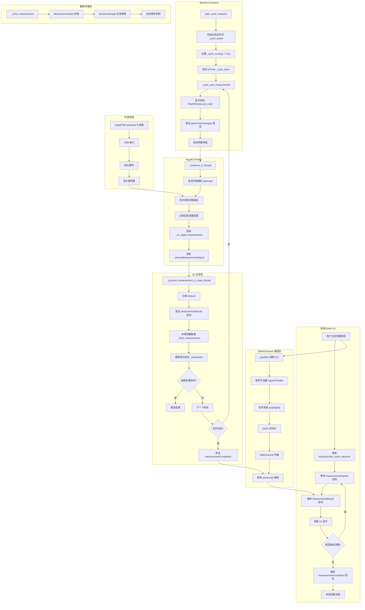
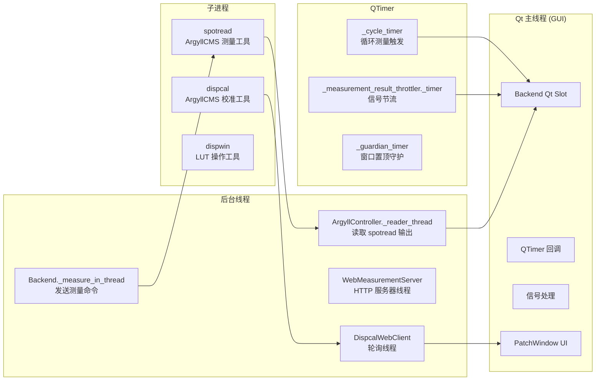

# P0-A: 架构与状态流审计报告

**任务编号**: P0-A  
**执行日期**: 2026-05-19  
**审计类型**: 只读架构分析  
**负责文件**: `src/backend.py`, `src/main_window.py`, `web/js/main.js`

---

## 1. 测量链路流程图 (Mermaid)



---

## 2. 关键状态变量清单 (28 个)

### 2.1 Backend 核心状态变量

| 序号 | 变量名 | 类型 | 初始值 | 读位置 | 写位置 | 说明 |
|------|--------|------|--------|--------|--------|------|
| 1 | `_cycle_running` | bool | False | `_cycle_next_measurement`, `_process_measurement_in_main_thread`, `stop_cycle` | `start_cycle_measure`, `stop_cycle`, `_stop_cycle_internal` | 循环测量运行标志 |
| 2 | `_session_state` | str | IDLE | `_handle_probe_disconnect`, `_resume_from_checkpoint` | `start_cycle_measure`, `_handle_probe_disconnect`, `_resume_from_checkpoint`, `_stop_cycle_internal` | 会话状态 (IDLE/RUNNING/RECONNECTING/SUSPENDED/COMPLETED) |
| 3 | `_lut_workflow_params` | Dict | None | `_finish_lut_workflow` | `start_lut_workflow`, `_finish_lut_workflow` | LUT 工作流参数保存 |
| 4 | `_null_profile_applied` | bool | False | `closeEvent`, `_stop_cycle_internal`, `start_cycle_measure` | `start_cycle_measure`, `_stop_cycle_internal`, `_finish_calibration_after_file_created` | Null Profile 挂载状态 |
| 5 | `_current_measure_mode` | str | 'gamut' | `set_measure_mode`, `_get_patch_list_for_mode` | `set_measure_mode` | 当前测量模式 (gamut/icc/lut/custom/ccmx) |
| 6 | `_cycle_queue` | List | [] | `_cycle_next_measurement` | `start_cycle_measure`, `stop_cycle`, `_resume_from_checkpoint` | 待测色块队列 [(r,g,b,name),...] |
| 7 | `_cycle_index` | int | 0 | `_cycle_next_measurement`, `_process_measurement_in_main_thread` | `start_cycle_measure`, `_process_measurement_in_main_thread`, `_resume_from_checkpoint` | 当前测量索引 |
| 8 | `_cycle_completed_data` | List | [] | `_resume_from_checkpoint` | `_process_measurement_in_main_thread`, `_stop_cycle_internal`, `start_cycle_measure` | 已完成的测量数据 |
| 9 | `_checkpoint` | MeasurementCheckpoint | None | `_handle_probe_disconnect`, `_resume_from_checkpoint` | `_handle_probe_disconnect`, `_stop_cycle_internal` | 断点数据结构 |
| 10 | `_current_patch_color` | tuple | (0,0,0) | `_process_measurement_in_main_thread`, `_show_color` | `set_color`, `_cycle_next_measurement` | 当前色块 RGB 值 |
| 11 | `_current_patch_name` | str | None | `_process_measurement_in_main_thread`, `_show_color` | `_cycle_next_measurement`, `set_patch_name` | 当前色块名称 |
| 12 | `_current_measurement_name` | str | "" | `_handle_probe_disconnect`, `_resume_from_checkpoint` | `start_cycle_measure` | 当前测量任务名称 |
| 13 | `_gamut_measurements` | Dict | {} | `_store_measurement`, `_analyze_gamut` | `_store_measurement`, `_clear_measurements`, `_resume_from_checkpoint` | RGBW 测量数据 |
| 14 | `_gamma_measurements` | List | [] | `_store_measurement`, `_analyze_gamma` | `_store_measurement`, `_clear_measurements`, `_resume_from_checkpoint` | 灰阶测量数据 |
| 15 | `_current_delay_ms` | int | 300 | `_show_color` | `set_measure_delay`, `_auto_configure_delay` | 测量延迟 (毫秒) |
| 16 | `_measure_delay` | int | 500 | `_show_color` | `set_measure_delay`, `_auto_configure_delay` | 用户可调节延迟 |
| 17 | `_current_display_type` | DisplayType | LCD | `_auto_configure_delay` | `set_display_type` | 显示器类型 |
| 18 | `_display_mode` | str | 'web' | `_show_color` | `set_display_mode` | 显示模式 (web/floating) |
| 19 | `_auto_clear_lut` | bool | True | `start_cycle_measure`, `_stop_cycle_internal` | `set_auto_clear_lut` | 自动清除 LUT 选项 |
| 20 | `_use_null_profile_for_measurement` | bool | False | `start_cycle_measure` | `set_null_profile_option` | 使用 Null Profile 选项 |
| 21 | `_linear_profile_path` | str | None | `start_cycle_measure`, `_stop_cycle_internal` | `_init_lut_controller` | 线性 ICC Profile 路径 |
| 22 | `_oled_mode_enabled` | bool | False | `_should_insert_oled_black_frame` | `set_oled_mode` | OLED 模式开关 |
| 23 | `_oled_waiting_black_frame` | bool | False | `_oled_black_frame_complete` | `_process_measurement_in_main_thread`, `_stop_cycle_internal` | OLED 黑帧等待状态 |
| 24 | `_oled_last_patch_brightness` | float | 0.0 | `_should_insert_oled_black_frame` | `_process_measurement_in_main_thread`, `_stop_cycle_internal` | 上一个色块亮度 |
| 25 | `_dark_sample_threshold` | float | 0.2 | `_process_measurement_in_main_thread` | `set_dark_sample_threshold` | 暗部多重采样阈值 |
| 26 | `_dark_sample_current_retry` | int | 0 | `_process_measurement_in_main_thread` | `_process_measurement_in_main_thread`, `_stop_cycle_internal` | 暗部重测计数 |
| 27 | `_dark_sample_measurements_xyz` | List | [] | `_calculate_dark_sample_average_xyz` | `_process_measurement_in_main_thread`, `_stop_cycle_internal` | 暗部 XYZ 数据缓存 |
| 28 | `_auto_reconnect_enabled` | bool | True | `_handle_probe_disconnect` | `set_auto_reconnect` | 自动重连选项 |

### 2.2 ArgyllController 状态变量

| 序号 | 变量名 | 类型 | 初始值 | 说明 |
|------|--------|------|--------|------|
| 1 | `_process` | subprocess.Popen | None | spotread 子进程句柄 |
| 2 | `_reader_thread` | threading.Thread | None | 后台输出读取线程 |
| 3 | `_is_connected` | bool | False | 探头连接状态 |
| 4 | `_is_measuring` | bool | False | 正在测量标志 |
| 5 | `_is_reconnecting` | bool | False | 重连状态标志 |
| 6 | `_probe_type` | ProbeType | I1_DISPLAY_PRO | 探头类型 |
| 7 | `_display_type` | DisplayType | LCD | 显示器类型 |
| 8 | `_correction_file_path` | str | "" | 光谱校正文件路径 |
| 9 | `_measurement_timeout` | float | 30.0 | 测量超时时间 (秒) |
| 10 | `_shutdown_event` | threading.Event | False | 线程退出信号 |
| 11 | `_hardware_error_event` | threading.Event | False | 硬件错误信号 |
| 12 | `_result_event` | threading.Event | False | 结果就绪信号 |
| 13 | `_current_result` | tuple | None | 当前测量结果 (x,y,Y) |
| 14 | `_last_measurement_time` | float | None | 上次测量时间戳 |
| 15 | `_dispcal_process` | subprocess.Popen | None | dispcal 子进程句柄 |

### 2.3 前端 JavaScript 状态变量

| 序号 | 变量名 | 类型 | 初始值 | 说明 |
|------|--------|------|--------|------|
| 1 | `isMeasuring` | bool | false | 单次测量状态 |
| 2 | `isCycleMeasuring` | bool | false | 循环测量状态 |
| 3 | `currentPatchName` | str | '' | 当前色块名称 |
| 4 | `currentPatchRGB` | object | null | 当前色块 RGB 值 |
| 5 | `probeConnected` | bool | false | 探头连接状态 |
| 6 | `currentMeasureMode` | str | 'gamut' | 当前测量模式 |
| 7 | `isCalibrating` | bool | false | 校准状态 |
| 8 | `calibrationDone` | bool | false | 校准完成标志 |
| 9 | `pendingMeasurementMode` | str | null | 待执行的测量模式 |
| 10 | `currentPatchList` | array | [] | 当前色块列表 |
| 11 | `allPatchList` | array | [] | 所有可测量色块列表 |
| 12 | `measuredPatches` | object | {} | 已测量色块跟踪 |

---

## 3. 可合并为状态机的状态变量

### 3.1 测量会话状态机 (推荐优先级: P1-最高)

当前分散状态：
- `_session_state` (IDLE/RUNNING/RECONNECTING/SUSPENDED/COMPLETED)
- `_cycle_running`
- `_is_reconnecting` (ArgyllController)
- `_oled_waiting_black_frame`

**建议合并为**: `MeasurementSessionStateMachine`

```python
class SessionState(Enum):
    IDLE = "idle"
    PREPARING = "preparing"       # 新增: 准备阶段 (清除 LUT/挂载 Null Profile)
    MEASURING = "measuring"       # 正在测量
    OLED_BLACK_FRAME = "oled_bfi" # OLED 黑帧等待
    DARK_SAMPLE_RETRY = "dark_retry"  # 暗部多重采样重测
    RECONNECTING = "reconnecting"  # 重连探头
    SUSPENDED = "suspended"       # 断点挂起
    COMPLETED = "completed"       # 完成
    ERROR = "error"               # 错误状态
```

**收益**:
- 状态转换清晰，减少并发 bug
- 状态检查一处即可判断，避免多处布尔变量不一致
- 便于调试和日志追踪

### 3.2 探头连接状态机 (推荐优先级: P1-高)

当前分散状态：
- `_is_connected` (ArgyllController)
- `_is_measuring` (ArgyllController)
- `_is_reconnecting` (ArgyllController)
- `probeConnected` (前端)

**建议合并为**: `ProbeConnectionStateMachine`

```python
class ProbeState(Enum):
    DISCONNECTED = "disconnected"
    CONNECTING = "connecting"
    CALIBRATING = "calibrating"   # 探头校准中
    READY = "ready"               # 就绪，可测量
    MEASURING = "measuring"       # 正在测量
    RECONNECTING = "reconnecting"  # 重连中
    ERROR = "error"               # 硬件错误
```

### 3.3 测量模式状态机 (推荐优先级: P2-中)

当前分散状态：
- `_current_measure_mode`
- `_gray_steps`
- `_icc_patch_count`
- `_lut_patch_count`
- `_icc_sample_strategy`
- `_lut_sample_strategy`

**建议合并为**: `MeasurementModeConfig`

```python
@dataclass
class MeasurementModeConfig:
    mode: str                    # gamut/icc/lut/custom/ccmx/dispcal
    gray_steps: int = 10
    icc_patch_count: int = 200
    lut_patch_count: int = 99
    icc_sample_strategy: str = 'balanced'
    lut_sample_strategy: str = 'balanced'
```

### 3.4 OLED 特殊模式状态 (推荐优先级: P2-中)

当前分散状态：
- `_oled_mode_enabled`
- `_oled_waiting_black_frame`
- `_oled_last_patch_brightness`
- `_oled_black_frame_delay_ms`
- `_oled_ui_settling_delay_ms`
- `_oled_bfi_trigger_threshold`
- `_oled_window_size_percent`

**建议合并为**: `OLEDModeConfig`

---

## 4. 线程边界分析

### 4.1 线程架构图



### 4.2 线程边界详细说明

| 边界名称 | 跨线程机制 | 安全措施 | 潜在风险 |
|----------|------------|----------|----------|
| spotread 输出 → 主线程 | `_internalMeasurementSignal` (pyqtSignal) | PyQt 信号队列机制 | 高频信号可能阻塞 |
| 主线程 → spotread 输入 | `stdin.write()` 直接写入 | 无锁，依赖进程同步 | 进程终止时写入失败 |
| dispcal Web → 主线程 | `_internalMeasurementSignal` | PyQt 信号队列 | URL 轮询延迟 |
| HTTP Server → 主线程 | 无直接通信 | 完全独立线程 | 端口占用风险 |
| QTimer → 主线程 | Qt 事件循环 | 自动线程安全 | Timer 堆积 |

### 4.3 信号节流机制

Backend 已实现以下节流器防止 IPC 洪峰阻塞：

1. **SignalThrottler** (`_measurement_result_throttler`)
   - 间隔: 30ms (约 33fps)
   - 目标信号: `measurementResult`

2. **SignalThrottler** (`_checkpoint_throttler`)
   - 间隔: 50ms (约 20fps)
   - 目标信号: `checkpointUpdated`

3. **LogMessageAggregator** (`_log_aggregator`)
   - 间隔: 100ms
   - 目标信号: `logMessage`
   - 策略: 多条日志合并发送

---

## 5. P1 拆分顺序建议

基于架构审计结果，建议按以下顺序拆分重构任务：

### Phase 1: 状态机重构 (优先级最高)

| 任务编号 | 任务名称 | 影范围 | 预估工作量 |
|----------|----------|--------|------------|
| P1-1 | 测量会话状态机 | Backend, ArgyllController | 4 天 |
| P1-2 | 探头连接状态机 | ArgyllController, 前端 | 2 天 |
| P1-3 | 状态转换日志统一 | Backend | 1 天 |

### Phase 2: 线程安全加固

| 任务编号 | 任务名称 | 影响范围 | 预估工作量 |
|----------|----------|----------|------------|
| P1-4 | QTimer 生命周期管理 | Backend | 1 天 |
| P1-5 | 子进程清理机制完善 | Backend, ArgyllController | 1 天 |
| P1-6 | 断点续测线程安全 | Backend | 2 天 |

### Phase 3: 数据流重构

| 任务编号 | 任务名称 | 影响范围 | 预估工作量 |
|----------|----------|----------|------------|
| P1-7 | MeasurementData 结构统一 | Backend, DataStorage | 2 天 |
| P1-8 | 信号序列化优化 | Backend, 前端 | 1 天 |
| P1-9 | 前端状态同步机制 | main.js | 1 天 |

---

## 6. 修改文件列表 (本任务只读审计)

| 文件路径 | 行数 | 分析内容 |
|----------|------|----------|
| `/Users/heng/Documents/vscode/Topos Calibrator/src/backend.py` | 7757 | Backend 类完整状态变量、信号定义、测量流程 |
| `/Users/heng/Documents/vscode/Topos Calibrator/src/main_window.py` | 115 | MainWindow 结构、QWebChannel 设置、窗口生命周期 |
| `/Users/heng/Documents/vscode/Topos Calibrator/src/patch_window.py` | 948 | PatchWindow 独立窗口、色块显示、守护定时器 |
| `/Users/heng/Documents/vscode/Topos Calibrator/src/argyll_controller.py` | 3891 | ArgyllController 探头控制、子进程管理、线程边界 |
| `/Users/heng/Documents/vscode/Topos Calibrator/web/js/main.js` | 5281 | 前端状态变量、信号处理、UI 更新逻辑 |

---

## 7. 实现思路总结

### 7.1 测量链路核心流程

1. **前端触发**: 用户点击测量按钮 → JavaScript 调用 `backend.start_cycle_measure`
2. **QWebChannel 传输**: pyqtSlot 接收调用 → 参数解析 → 初始化状态
3. **Backend 处理**: 设置 `_cycle_running=True` → 初始化色块队列 → 启动 QTimer
4. **色块显示**: QTimer 触发 `_cycle_next_measurement` → PatchWindow 显示色块 → 发送颜色信号到前端
5. **ArgyllController 测量**: 后台线程发送空格键 → spotread 测量 → 后台线程读取输出 → 正则解析结果
6. **跨线程通信**: `_internalMeasurementSignal` → 主线程处理 → 发送 `measurementResult`
7. **数据存储**: `_store_measurement` → MeasurementData → SessionStorage → 自动保存
8. **循环继续**: QTimer 触发下一个色块 → 重复 4-7
9. **完成**: 队列空 → 发送 `measurementCompleted` → 前端更新状态

### 7.2 状态管理复杂性分析

当前架构存在以下问题：

1. **状态分散**: 28+ 个状态变量分散在 Backend、ArgyllController、前端，缺乏统一管理
2. **布尔变量耦合**: `_cycle_running`、`_is_measuring`、`_oled_waiting_black_frame` 等多个布尔变量可能不一致
3. **线程边界模糊**: 主线程与后台线程的同步依赖 PyQt 信号，但缺乏显式状态转换
4. **断点续测复杂**: `_checkpoint`、`_session_state`、`_cycle_completed_data` 三者紧密关联，容易出错

### 7.3 状态机重构收益

1. **可维护性**: 状态转换一目了然，便于调试
2. **线程安全**: 状态机可在主线程统一管理，避免并发问题
3. **测试覆盖**: 状态机易于单元测试，覆盖所有转换路径
4. **日志追踪**: 状态转换自动记录，便于问题定位

---

## 8. 验证命令和结果

本任务为只读审计，无需执行验证命令。

建议后续任务的验证命令：

```bash
# P1-1 状态机重构验证
python -c "from src.backend import Backend; b = Backend(); print(b._session_state)"

# P1-2 探头状态机验证
python -c "from src.argyll_controller import ArgyllController; c = ArgyllController(); print(c._is_connected)"

# 状态转换日志验证
python main.py --debug  # 检查状态转换日志输出
```

---

## 9. 风险和未完成项

### 9.1 已识别风险

| 风险类型 | 风险描述 | 影响程度 | 建议 |
|----------|----------|----------|------|
| 并发风险 | `_cycle_running` 与 `_session_state` 可能不一致 | 高 | P1-1 状态机重构 |
| 进程泄漏 | spotread 异常退出时可能残留僵尸进程 | 中 | 已有 atexit 机制，需加强 |
| 信号阻塞 | 高频测量时 QWebChannel 可能阻塞 | 中 | 已有节流器，需验证效果 |
| 状态丢失 | 断点续测时 `_checkpoint` 数据可能不完整 | 中 | P1-6 线程安全加固 |
| 前端同步 | 前端 `isCycleMeasuring` 与 Backend `_cycle_running` 可能不一致 | 中 | P1-9 前端状态同步 |

### 9.2 未完成项

1. **ArgyllCMS 子进程完整生命周期追踪**: 需进一步分析 subprocess.Popen 与 daemon thread 的交互
2. **前端状态机建议**: 前端 JavaScript 也可引入状态机模式，与 Backend 状态同步
3. **信号节流效果验证**: 需实测高频测量时的 IPC 性能
4. **跨平台差异分析**: macOS/Windows/Linux 线程边界可能不同

---

## 10. 解锁的后续任务

完成本审计后，以下任务可立即开始：

| 任务编号 | 任务名称 | 依赖关系 | 可开始时间 |
|----------|----------|----------|------------|
| P1-1 | 测量会话状态机重构 | 无依赖 | 立即 |
| P1-2 | 探头连接状态机重构 | 无依赖 | 立即 |
| P1-3 | 状态转换日志统一 | 依赖 P1-1, P1-2 | P1-1 完成后 |
| P1-4 | QTimer 生命周期管理 | 无依赖 | 立即 |
| P1-5 | 子进程清理机制完善 | 无依赖 | 立即 |

---

**审计完成签名**: Agent P0-A  
**审计完成时间**: 2026-05-19