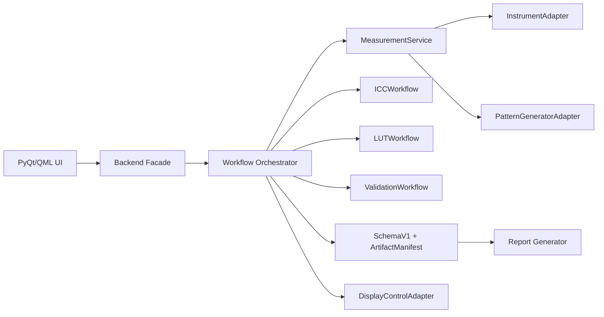

# Topos Calibrator Calman 级专业化升级计划

更新日期：2026-05-19  
目标读者：后续负责实现的 AI Agent、人类开发者、测试/发布负责人  
目标：把 Topos Calibrator 从“功能雏形已经丰富的校色工具”升级成“专业级屏幕校色平台”，长期对标 Calman Ultimate 的能力边界。

---

## 0. 一句话结论

项目已经补齐了大量专业化基础设施，包括色彩科学模块、仪器抽象、ICC/LUT/验证 workflow、存储 schema、报告生成、预检和诊断模块。  
但当前还不能认为“已经完成专业化升级”，因为主程序 `Backend` 仍是 8605 行巨型类，新建 workflow 多数没有真正接入主测量链路，完整测试存在失败和挂起，部分桥接代码一旦启用会触发运行时错误。

下一步不要先继续堆新功能。正确顺序是：

1. 先修 P0 质量闸门：测试必须稳定、桥接代码必须可运行、smoke test 必须区分源码环境和打包环境。
2. 再把 MeasurementService、ICCWorkflow、LUTWorkflow、ValidationWorkflow 接入主链路，并保留 legacy fallback。
3. 然后扩展 Calman 级能力：硬件生态、AutoCal/DDC、3D LUT、高级验证图表、工作流编辑器、专业报告、发布/签名/实验室验证。

---

## 1. Calman 对标口径

本计划只对标公开可见的产品能力，不复制任何专有算法或未公开接口。

官方公开信息显示，Calman Ultimate 面向校准专家、AV 安装商和制造商，强调完整能力解锁、广泛硬件/显示器兼容、工作流自定义、AutoCal、HDR workflow、3D LUT workflow 等能力。Portrait Displays 官方下载页当前可见 Calman 2025 版本为 5.17.0.3，发布日期为 2025-09-03。

参考来源：

- Portrait Displays 产品页：https://www.portrait.com/products/index.html
- Portrait Displays 软件下载页：https://www.portrait.com/software-downloads/

### 1.1 对标能力矩阵

| 能力 | Calman 公开能力方向 | Topos 当前状态 | Topos 目标状态 |
| --- | --- | --- | --- |
| 专业工作流 | 自定义 workflow、不同场景模板 | 有多个 workflow 模块，但主链路未完全接入 | JSON/GUI 双模式工作流编辑器，支持模板、步骤恢复、批量任务 |
| 硬件兼容 | 多仪器、多显示设备、多 pattern generator | 有 InstrumentAdapter/ArgyllAdapter 雏形 | 仪器、显示控制、pattern generator 三类 adapter 体系 |
| AutoCal/DDC | 自动调显示器灰阶、CMS、LUT | 目前未形成统一自动调参闭环 | 支持 DDC/CI、厂商 IP/API、外部 LUT 设备的可插拔 AutoCal |
| 3D LUT | 专业 LUT 生成、验证、导出 | 有 LUTWorkflow 雏形 | 17/21/33/65 点 LUT、四面体插值、平滑、gamut mapping、多格式导出 |
| HDR | HDR workflow、PQ/HLG 等目标 | 有部分预检和色彩科学基础 | PQ/HLG/BT.1886/sRGB 目标完整验证和报告 |
| 报告 | 专业图表、前后对比、可交付报告 | 有 reports/generator.py | 可配置报告模板、品牌化、PDF/HTML、项目审计记录 |
| 发布质量 | 商业级安装、版本管理 | 有 packaging/scripts，但 smoke test 依赖 dist bundle | CI、签名、公证、自动更新、崩溃日志、真实设备验证矩阵 |

---

## 2. 当前复查发现的问题

以下是 2026-05-19 对当前工作区的检查结论。后续 agent 必须先处理 P0/P1，再做新功能。

| ID | 严重级别 | 问题 | 证据 | 修复方向 |
| --- | --- | --- | --- | --- |
| P0-01 | 阻塞 | 完整测试不稳定，`pytest -q` 出现失败后继续跑会挂起 | `pytest -q -x --tb=short` 首个失败是 `tests/test_color_science/test_gamut_sampling.py::TestSRGBLabBoundary::test_boundary_for_L0`；单跑 `test_lut_high_precision_strategy` 会长时间无响应 | 修复 gamut boundary 和 LUT high precision sampler，并给慢测试加超时/性能断言 |
| P0-02 | 阻塞 | sRGB Lab 边界在 L=0/L=100 端点不合理 | L=0 时 `a_max=13.8024`，测试期望接近 0；L=100 时 `abs(a_min)=14.7286` | `get_srgb_lab_boundary_for_L()` 对端点做数学正确处理，避免采样误差把黑白点扩成彩色边界 |
| P0-03 | 阻塞 | LUT 高精度采样存在性能/终止风险 | `tests/test_color_science/test_gamut_sampling.py::TestGamutSampler::test_lut_high_precision_strategy` 挂起，需要手动 kill | profile `GamutSampler.generate_patches(1500)`，把复杂搜索改成有上限的确定性采样 |
| P0-04 | 阻塞 | `BackendMeasurementBridge` 当前启用会运行时失败 | `src/workflows/backend_measurement_bridge.py` 使用 `MeasurementSessionState` 但未导入；`_convert_checkpoint()` 从 `src.data_storage` 导入 `MeasurementCheckpoint`，但该类在 `src/backend.py` | 提取共享 session type 或修正导入，避免循环依赖 |
| P0-05 | 高 | 新 MeasurementService 未接入主测量链路 | `docs/agent_handoffs/P1-C_backend_refactor.md` 明确写着 Backend 尚未调用 bridge；`src/backend.py` 未使用 `BackendMeasurementBridge` | 加 feature flag，先 dark launch，再替换 `_start_cycle`/`stop_cycle` |
| P0-06 | 高 | `Backend` 仍然巨大，重构目标未达成 | `src/backend.py` 当前 8605 行 | 用 facade/service 分层逐步搬迁，不要继续把新业务塞回 Backend |
| P0-07 | 高 | 预检 progress 信号定义了但主流程没有发进度 | `preflightCheckProgress` 在 `src/backend.py` 定义，`run_preflight_check()` 只 emit started/completed | 为 `PreflightChecker` 添加 progress callback 或逐项 emit |
| P0-08 | 中 | smoke test 对开发环境不友好 | `python3 scripts/smoke_test.py` 失败：`dist/Topos Calibrator.app` 不存在 | 拆成 source smoke 和 packaged smoke；没有 dist 时 package smoke 应 skip 而不是 fail |
| P1-01 | 高 | ICC/LUT/Validation workflow 还不是产品主流程 | `ICCWorkflow`、`LUTWorkflow`、`ValidationWorkflowService` 存在，但 Backend/UI 接入不足 | 增加 Backend slot/signal、UI 页面状态、artifact 输出 |
| P1-02 | 高 | 新 SchemaV1/Manifest 未成为统一保存入口 | `reports/generator.py` 支持 SchemaV1，`comparison_window.py` 可读 manifest，但主测量保存仍可能走 legacy | 所有新 session 同时写 SchemaV1 + manifest，legacy 只作兼容导出 |
| P1-03 | 中 | 真实硬件矩阵和自动化验证不足 | 仪器/显示设备兼容性目前主要靠代码和 fixture | 建立 hardware lab matrix，fake adapter 与真实设备测试分层 |

### 2.1 当前已验证通过的部分

以下检查通过，说明基础模块不是一团乱：

```bash
python3 -m py_compile main.py src/*.py src/**/*.py tests/**/*.py
pytest -q tests/test_manifest.py tests/test_schema.py tests/test_reports --tb=short
pytest -q tests/test_instruments tests/test_diagnostics --tb=short
```

已观察结果：

- Python 编译检查通过。
- manifest/schema/reports 相关测试 126 passed。
- instruments/diagnostics 相关测试 179 passed。

### 2.2 当前不能继续跳过的问题

任何 agent 如果想直接做 AutoCal、HDR、3D LUT 新功能，必须先确认下面命令稳定通过：

```bash
pytest -q -x --tb=short
pytest -q tests/test_color_science/test_gamut_sampling.py --tb=short
python3 scripts/source_smoke_test.py
```

如果这三条不通过，不允许进入 P2 之后的功能扩展。

---

## 3. 总体架构目标

最终架构应从“巨型 Backend 直接管理一切”变成下面的形态：



核心原则：

- `Backend` 只做 UI facade、信号转换、用户设置读取，不再承载复杂业务。
- 所有长任务必须由 workflow/service 驱动，可取消、可恢复、有 checkpoint、有 artifact manifest。
- 所有外设都走 adapter，不允许业务代码直接拼接厂商命令。
- 所有校准结果必须可追溯：原始测量、环境信息、目标、软件版本、仪器信息、报告、导出文件都进入 manifest。
- 所有专业算法必须有单元测试、fixture、性能上限和真实设备验证计划。

---

## 4. 总路线图

| 阶段 | 名称 | 时间估计 | 可并行性 | 退出标准 |
| --- | --- | --- | --- | --- |
| P0 | 质量闸门修复 | 1-3 天 | 高 | 完整 pytest 不失败不挂起；source smoke 通过；bridge 可导入可启用 |
| P1 | 主链路接入 | 1-2 周 | 中 | MeasurementService/ICC/LUT/Validation 至少一条完整 workflow 可从 UI 跑通 |
| P2 | 专业校准核心 | 2-4 周 | 高 | 自动测量、灰阶/gamut/LUT/验证闭环可重复执行 |
| P3 | 硬件生态 | 3-6 周 | 高 | 仪器、显示控制、pattern generator adapter 稳定，至少 3 类设备实测 |
| P4 | 工作流编辑器和专业 UI | 2-4 周 | 中 | 用户可创建/保存/运行自定义校准 workflow |
| P5 | 报告和实验室验证 | 2-3 周 | 高 | 生成专业报告，支持前后对比、HDR/SDR 图表、项目归档 |
| P6 | 商业级发布 | 1-3 周 | 中 | macOS app 打包、签名、公证、更新、崩溃日志和发布说明齐全 |
| P7 | 长期增强 | 持续 | 高 | 脚本化、插件系统、远程控制、多人项目等高级能力 |

---

## 5. P0 质量闸门修复

P0 是强制阶段。所有 agent 可以并行，但必须每天合并一次并跑完整测试。

### P0-A：修复 gamut boundary 和 LUT sampler

| 项 | 内容 |
| --- | --- |
| 负责人 | Color Science Agent |
| 主要文件 | `src/color_science/gamut_sampling.py`, `tests/test_color_science/test_gamut_sampling.py` |
| 不要触碰 | UI、Backend、存储、报告 |
| 依赖 | 无 |
| 目标 | `get_srgb_lab_boundary_for_L()` 在 L=0/L=100 数学正确；`generate_patches(1500)` 不挂起 |

实现步骤：

1. 阅读 `get_srgb_lab_boundary_for_L()`、`is_in_srgb_gamut()`、`GamutSampler.generate_patches()`。
2. 对 L 接近 0 和 100 的端点单独处理：
   - 当 `L <= epsilon` 时，边界应退化到黑点附近，`a_min/a_max/b_min/b_max` 接近 0。
   - 当 `L >= 100 - epsilon` 时，边界应退化到白点附近，`a_min/a_max/b_min/b_max` 接近 0。
   - epsilon 建议 0.01 或与现有 Lab/RGB 转换误差一致。
3. 对中间 L 值保留采样/搜索，但必须设置最大迭代次数。
4. profile `GamutSampler(SamplingStrategy.LUT_HIGH_PRECISION).generate_patches(1500)`：
   - 不允许 while 循环依赖“直到数量满足”为唯一退出条件。
   - 所有循环必须有明确上限。
   - 1500 色块生成建议小于 2 秒，最多不能超过 5 秒。
5. 如果策略本身理论上生成不了请求数量，允许返回小于 count 的结果，但要稳定、去重、有日志或注释说明。
6. 增加性能测试：
   - `generate_patches(1500)` 必须在固定时间内返回。
   - 不要求精确数量，但应 `len(patches) >= 100` 且无重复。

验收命令：

```bash
pytest -q tests/test_color_science/test_gamut_sampling.py --tb=short
pytest -q -x --tb=short
```

### P0-B：修复 BackendMeasurementBridge 运行时错误

| 项 | 内容 |
| --- | --- |
| 负责人 | Backend Bridge Agent |
| 主要文件 | `src/workflows/backend_measurement_bridge.py`, `src/backend.py`, 可新增 `src/core/session.py` |
| 不要触碰 | 色彩算法、报告、打包 |
| 依赖 | P0-A 可并行 |
| 目标 | bridge 可导入、可构造、可 start/stop fake session，不触发 NameError/ImportError |

实现步骤：

1. 修复 `MeasurementSessionState` 未导入问题。
2. 修复 `_convert_checkpoint()` 错误导入：
   - 当前代码从 `src.data_storage` 导入 `MeasurementCheckpoint`，但类实际在 `src/backend.py`。
   - 最稳做法是把 `MeasurementSessionState`、`MeasurementCheckpoint`、`ResumeInfo` 提取到 `src/core/session.py`，`backend.py` 和 bridge 都从那里导入。
   - 如果短期不想大改，则在 bridge 内用轻量 dict checkpoint，避免反向导入 `backend.py` 造成循环。
3. 增加测试：
   - bridge import 测试。
   - fake backend + fake instrument + fake presenter 构造测试。
   - state change 回调同步 `_cycle_running` 和 `_session_state` 测试。
4. 不要在此任务里大规模替换 Backend 主链路，只保证 bridge 自身可靠。

验收命令：

```bash
python3 -m py_compile src/workflows/backend_measurement_bridge.py src/backend.py
pytest -q tests/test_workflows/test_measurement_service.py --tb=short
pytest -q -k "bridge or measurement_service" --tb=short
```

### P0-C：拆分 smoke test

| 项 | 内容 |
| --- | --- |
| 负责人 | Tooling/Release Agent |
| 主要文件 | `scripts/smoke_test.py`, 可新增 `scripts/source_smoke_test.py`, `scripts/package_smoke_test.py` |
| 不要触碰 | 业务代码 |
| 依赖 | 无 |
| 目标 | 开发环境 smoke 不依赖 `dist/Topos Calibrator.app` |

实现步骤：

1. 保留现有 packaged smoke 逻辑，但改名或拆出为 `scripts/package_smoke_test.py`。
2. 新增 `scripts/source_smoke_test.py`：
   - 检查 Python 版本。
   - 检查关键模块可导入。
   - 检查 `main.py` 存在。
   - 检查 `src/backend.py`、`src/color_science`、`src/workflows` 基础导入。
   - 不启动真实 GUI，不要求 app bundle。
3. `scripts/smoke_test.py` 可作为总入口：
   - 默认跑 source smoke。
   - 如果 dist app 存在，再跑 packaged smoke。
   - 如果 dist app 不存在，输出 SKIP，而不是 exit 1。

验收命令：

```bash
python3 scripts/source_smoke_test.py
python3 scripts/smoke_test.py
```

### P0-D：补齐预检进度和 override 行为测试

| 项 | 内容 |
| --- | --- |
| 负责人 | Preflight Agent |
| 主要文件 | `src/workflows/preflight.py`, `src/backend.py`, 相关 UI 文件 |
| 不要触碰 | 测量算法、LUT、报告 |
| 依赖 | 无 |
| 目标 | `preflightCheckProgress` 在每项检查时 emit；override 后 `can_proceed` 逻辑可测 |

实现步骤：

1. 查看 `PreflightChecker.run_all_checks()` 是否能注入 progress callback。
2. 如果不能，给 `PreflightChecker` 增加可选 `progress_callback(current, total, item_id, label)`。
3. 在 `Backend.run_preflight_check()` 中把 callback 转成 JSON：

```json
{"current": 1, "total": 20, "item": "argyll_spotread", "label": "Argyll spotread"}
```

4. 确保 Qt 跨线程发 signal 使用 `QTimer.singleShot(0, ...)`。
5. 增加测试：progress 至少 emit 一次，completed 一定最后 emit。

验收命令：

```bash
pytest -q tests/test_workflows/test_preflight.py --tb=short
pytest -q -k preflight --tb=short
```

### P0-E：建立最小 CI 测试分层

| 项 | 内容 |
| --- | --- |
| 负责人 | CI Agent |
| 主要文件 | `pyproject.toml` 或 pytest 配置、CI 配置文件、`scripts/` |
| 不要触碰 | 产品逻辑 |
| 依赖 | P0-A/P0-C 最好先合并 |
| 目标 | 任何挂起测试都能被超时机制截断，CI 输出能定位问题 |

实现步骤：

1. 找到项目当前 pytest 配置。如果没有，新增最小配置。
2. 增加测试分组：
   - `unit`: 不依赖 GUI/硬件/打包。
   - `workflow`: fake adapter 下跑 workflow。
   - `integration`: 可依赖 Argyll fake 或本机工具。
   - `package`: 依赖 dist app。
   - `hardware`: 真实设备手动/实验室执行。
3. 给慢测试加 timeout。若项目未安装 `pytest-timeout`，先评估是否加入依赖；不想加依赖则在慢测试中用线程/进程级 guard。
4. CI 第一阶段只跑 `unit + workflow + source smoke`，不要卡在真实硬件。

验收命令：

```bash
pytest -q -m "not hardware and not package" --tb=short
python3 scripts/source_smoke_test.py
```

---

## 6. P1 主链路接入

P1 的目标是把已经写好的专业模块从“旁路代码”变成“真实产品路径”。必须保留 legacy fallback，不能一次性推翻旧链路。

### P1-A：MeasurementService dark launch

| 项 | 内容 |
| --- | --- |
| 负责人 | Backend Integration Agent |
| 主要文件 | `src/backend.py`, `src/workflows/backend_measurement_bridge.py`, `src/workflows/measurement_service.py` |
| 可并行 | 可与 P1-B/P1-C 并行，但会有 Backend 合并冲突，需要明确 ownership |
| 目标 | 用户可以通过设置/环境变量切换 legacy measurement 和 MeasurementService |

实现步骤：

1. 在 `Backend.__init__()` 初始化：
   - `_measurement_bridge`
   - `_use_measurement_service`
   - `_measurement_service_fallback_enabled`
2. 提供 feature flag：
   - 开发期可用环境变量 `TOPOS_USE_MEASUREMENT_SERVICE=1`。
   - UI 设置后续再补。
3. 修改开始测量入口：
   - 如果 flag 关闭，走 legacy。
   - 如果 flag 开启，调用 bridge。
   - bridge 报错时记录 error，并在允许 fallback 时切回 legacy。
4. 修改停止/暂停/恢复入口，让 MeasurementService 负责状态，Backend 只做信号转发。
5. 保留旧接口签名，避免 QML/PyQt 端大面积修改。
6. 增加 fake adapter 集成测试：
   - legacy path 测一次。
   - service path 测一次。
   - service path failure fallback 测一次。

退出标准：

- 不插真实仪器时，fake measurement workflow 可完成。
- 打开 feature flag 后，UI 不崩溃。
- 关闭 feature flag 后，旧测量行为不回归。

### P1-B：SchemaV1 + Manifest 成为主保存格式

| 项 | 内容 |
| --- | --- |
| 负责人 | Storage Agent |
| 主要文件 | `src/storage/schema.py`, `src/storage/manifest.py`, `src/data_storage.py`, `src/backend.py`, `src/reports/generator.py` |
| 可并行 | 可与 P1-A 并行，但 Backend 保存入口需协调 |
| 目标 | 每次新测量 session 都有标准 manifest 和 SchemaV1 JSON |

实现步骤：

1. 找到当前保存测量数据的唯一入口。如果没有唯一入口，先创建 `StorageService`。
2. 新增 `save_session(schema: SchemaV1, artifacts: list)`：
   - 写 `measurement.schema.v1.json`。
   - 写 `manifest.json`。
   - 写 legacy JSON 兼容副本，文件名标明 legacy。
3. 所有 artifact 写入后计算 hash、size、created_at。
4. 报告生成器优先读取 SchemaV1。
5. comparison window 只读 manifest，不直接猜测目录结构。
6. 增加 migration 测试：
   - legacy -> SchemaV1。
   - SchemaV1 -> legacy export。
   - manifest validate。

退出标准：

- 新 session 目录结构稳定。
- 旧数据仍能打开。
- reports/comparison 不再依赖隐式路径猜测。

### P1-C：ICCWorkflow 接入 UI/Backend

| 项 | 内容 |
| --- | --- |
| 负责人 | ICC Workflow Agent |
| 主要文件 | `src/workflows/icc_workflow.py`, `src/backend.py`, UI 相关文件 |
| 可并行 | 可与 LUT/Validation 并行 |
| 目标 | 用户能从 UI 选择目标并生成 ICC profile |

实现步骤：

1. 给 Backend 增加 slot：
   - `start_icc_workflow(config_json)`
   - `pause_icc_workflow()`
   - `resume_icc_workflow(session_dir)`
   - `cancel_icc_workflow()`
2. 增加 signal：
   - `iccWorkflowStateChanged`
   - `iccWorkflowProgress`
   - `iccWorkflowCompleted`
   - `iccWorkflowFailed`
3. UI 配置至少包含：
   - 白点：D65、D50、自定义 xy。
   - gamma/EOTF：sRGB、2.2、2.4、BT.1886。
   - 亮度目标。
   - patch set：quick、standard、high precision。
4. ICCWorkflow 应使用 MeasurementService 的测量结果，而不是重新定义测量逻辑。
5. 生成 artifact：
   - `.icc`
   - 测量 JSON
   - profile log
   - manifest entry

退出标准：

- fake adapter 下可完整生成 profile artifact。
- 异常中断后可从 checkpoint 恢复。

### P1-D：LUTWorkflow 接入 UI/Backend

| 项 | 内容 |
| --- | --- |
| 负责人 | LUT Agent |
| 主要文件 | `src/workflows/lut_workflow.py`, `src/backend.py`, UI 相关文件 |
| 可并行 | 可与 ICC/Validation 并行 |
| 目标 | 用户能生成并验证 1D/3D LUT |

实现步骤：

1. Backend 增加 slot/signal，命名参考 ICCWorkflow。
2. LUT config 支持：
   - LUT 类型：1D、3D。
   - grid size：17、21、33，65 可作为高级/实验选项。
   - interpolation：trilinear、tetrahedral。
   - target：sRGB、Rec.709、P3-D65、BT.2020、HDR PQ。
   - export：`.cube` 起步，后续扩展。
3. LUT 生成前必须校验测量点密度，不足时提示补测。
4. LUT 生成后必须自动跑 validation patch set。
5. manifest 记录 LUT 参数、输入测量 hash、目标、验证结果。

退出标准：

- fake data 可生成 `.cube`。
- validation 后报告显示 before/after。
- 生成时间有性能上限。

### P1-E：ValidationWorkflow 成为所有结果的共同验收层

| 项 | 内容 |
| --- | --- |
| 负责人 | Validation Agent |
| 主要文件 | `src/workflows/validation_workflow.py`, `src/reports/generator.py`, `src/backend.py` |
| 可并行 | 可与 ICC/LUT 并行 |
| 目标 | ICC、LUT、仅测量三种路径都能产出统一 validation result |

实现步骤：

1. 定义统一 validation 输入：
   - target color space。
   - measured samples。
   - optional applied profile/LUT。
2. 定义统一 validation 输出：
   - average/max Delta E。
   - grayscale tracking。
   - gamma/EOTF tracking。
   - gamut coverage/volume。
   - pass/fail。
3. 所有 workflow 完成后调用 ValidationWorkflow。
4. 报告只消费 validation result，不再自己重新计算所有指标。

退出标准：

- ICC/LUT/measurement-only 三条路径输出同一种 validation JSON。
- 报告可直接读取 validation JSON 生成图表。

### P1-F：Backend 瘦身第一轮

| 项 | 内容 |
| --- | --- |
| 负责人 | Architecture Agent |
| 主要文件 | `src/backend.py`, `src/core/`, `src/workflows/`, `src/storage/` |
| 可并行 | 建议等 P1-A 基本稳定后做 |
| 目标 | Backend 从 8605 行降到 6000 行以下，且不改变 UI API |

实现步骤：

1. 不要追求一次性重构完。先搬迁低风险代码：
   - session type。
   - preflight facade。
   - report facade。
   - storage facade。
2. 每搬一个模块，做一层兼容方法留在 Backend，内部委托 service。
3. 每次搬迁后跑完整测试。
4. 给 Backend 留下清晰分区：
   - Qt signals/slots。
   - 用户设置读取。
   - service wiring。
   - legacy compatibility。

退出标准：

- Backend 行数明显下降。
- UI 端 import/slot/signal 不需要大改。
- 行为测试通过。

---

## 7. P2 专业校准核心

P2 开始才是真正“像 Calman 一样专业”的功能层。此阶段不要由一个 agent 独占，必须拆成算法、测量、LUT、验证、UI 五条线。

### P2-A：目标模型和色彩标准

| 项 | 内容 |
| --- | --- |
| 负责人 | Color Standards Agent |
| 主要文件 | `src/color_science/`, `tests/test_color_science/` |
| 目标 | 所有 workflow 使用统一目标模型 |

必须支持：

- SDR：sRGB、Rec.709、Gamma 2.2、Gamma 2.4、BT.1886。
- Wide gamut：Display P3 / P3-D65、Adobe RGB、BT.2020。
- HDR：PQ/ST 2084、HLG、可配置 peak luminance。
- 白点：D65、D50、自定义 xy。
- Delta E：CIE76、CIE94、CIEDE2000，默认报告用 CIEDE2000。
- CCT/Duv：用于灰阶和白点偏差。

实现思路：

1. 新增 `TargetProfile` 数据结构，所有 ICC/LUT/Validation 都引用它。
2. 不允许各模块各自硬编码 D65/gamma。
3. 给每个标准添加 golden fixture。
4. 色彩转换必须有数值容差测试。

### P2-B：专业 patch set 引擎

| 项 | 内容 |
| --- | --- |
| 负责人 | Patch Strategy Agent |
| 主要文件 | `src/color_science/gamut_sampling.py`, 新增 `src/color_science/patch_sets.py` |
| 目标 | 不同用途使用不同 patch set，而不是一个采样器包打天下 |

必须支持：

- 快速预检 patch set：10-30 点。
- 灰阶 patch set：5/11/21 点。
- gamma/EOTF ramp：可配置步数。
- ColorChecker / memory colors。
- 饱和度扫描：25/50/75/100%，每个 primary/secondary。
- 色相扫描。
- 3D LUT cube：9/17/21/33 grid。
- Adaptive patch set：根据上一轮误差追加高风险区域。

实现思路：

1. 新增 `PatchSet`、`Patch`、`PatchPurpose`。
2. `GamutSampler` 只做算法采样，不负责 workflow 语义。
3. 每个 patch set 都可导出：
   - RGB 8-bit/10-bit。
   - Lab/XYZ target。
   - display order。
   - expected duration。
4. patch set 生成必须 deterministic，默认带 seed。

### P2-C：测量可靠性和统计

| 项 | 内容 |
| --- | --- |
| 负责人 | Measurement Reliability Agent |
| 主要文件 | `src/workflows/measurement_service.py`, `src/color_science/statistics.py` |
| 目标 | 测量不只是读数，还要有稳定性、置信度、异常处理 |

必须支持：

- 仪器 warm-up。
- dark sample 策略。
- OLED/miniLED 稳定等待。
- repeat measurement。
- outlier rejection。
- moving average / median。
- 每个点的 measurement confidence。
- 黑位附近低亮处理。
- 探头断连恢复。

实现思路：

1. `MeasurementResult` 加字段：
   - raw readings。
   - repeat count。
   - standard deviation。
   - confidence。
   - rejected readings。
2. MeasurementService 支持 per-patch policy。
3. 黑位/低亮区使用更长 integration 或重复次数。
4. 报告展示“测量可信度”，避免只给 Delta E。

### P2-D：自动校准闭环

| 项 | 内容 |
| --- | --- |
| 负责人 | AutoCal Agent |
| 主要文件 | 新增 `src/workflows/autocal_workflow.py`, `src/instruments/display_control.py` |
| 目标 | 建立从测量到自动调整的闭环 |

第一版目标：

- 自动调整亮度/对比度提示或 DDC 调整。
- 自动灰阶两点/多点建议。
- 如果显示设备支持 DDC/API，则自动写入参数。
- 如果不支持，则生成手动调整指导。
- 调整后自动复测并判断是否收敛。

实现思路：

1. 新增 `DisplayControlAdapter`：
   - `get_capabilities()`
   - `read_control(name)`
   - `write_control(name, value)`
   - `commit()`
   - `rollback()`
2. AutoCalWorkflow 步骤：
   - preflight。
   - baseline measurement。
   - solve adjustment。
   - apply adjustment。
   - verify。
   - iterate until threshold or max iterations。
3. 每次写设备前保存 rollback snapshot。
4. 所有自动调整都必须有 dry-run 模式。

### P2-E：3D LUT 专业化

| 项 | 内容 |
| --- | --- |
| 负责人 | 3D LUT Agent |
| 主要文件 | `src/workflows/lut_workflow.py`, 新增 `src/color_science/lut3d.py` |
| 目标 | 形成可靠的 LUT 建模和导出能力 |

必须支持：

- grid size：17、21、33，65 作为高级选项。
- interpolation：trilinear、tetrahedral。
- smoothing/regularization。
- neutral axis preservation。
- black/white point protection。
- gamut clipping 和 perceptual gamut mapping 两种策略。
- `.cube` 导出第一优先级。
- LUT 应用模拟：给 validation 使用。

实现思路：

1. 不要把 LUT 算法写在 workflow 里，放入 `src/color_science/lut3d.py`。
2. workflow 只负责准备数据、调用算法、保存 artifact。
3. 用 synthetic display model 生成 fixture：
   - identity display。
   - gamma 偏差 display。
   - gamut matrix 偏差 display。
   - 非线性偏差 display。
4. 验证 LUT 后 Delta E 应显著下降，否则标记失败。

---

## 8. P3 硬件生态

Calman 级竞争力很大一部分来自硬件生态。Topos 必须把“仪器、显示设备、pattern generator”拆成三个清晰 adapter 体系。

### P3-A：InstrumentAdapter 扩展

目标设备优先级：

1. ArgyllCMS 已支持的主流仪器。
2. X-Rite/Calibrite i1Display 系列。
3. Datacolor Spyder 系列。
4. ColorMunki / i1Pro 类光谱仪。
5. 高端仪器作为长期目标：Klein、JETI、Colorimetry Research 等，具体需按官方 SDK/授权评估。

实现步骤：

1. `InstrumentAdapter` 能力查询：
   - 是否支持 ambient。
   - 是否支持 spectral。
   - 最小亮度能力。
   - recommended integration time。
2. correction 管理：
   - CCSS/CCMX/EDR import。
   - correction 与显示类型绑定。
   - 每次测量记录 correction hash。
3. instrument diagnostics：
   - connected。
   - calibration required。
   - dark sample age。
   - last error。

### P3-B：DisplayControlAdapter

目标能力：

- DDC/CI：亮度、对比度、色温、RGB gain/offset。
- macOS 显示信息读取。
- 外部显示器能力探测。
- 厂商 API/IP 控制作为插件扩展，不写死在核心。

实现步骤：

1. 新增 `src/instruments/display_control.py` 或 `src/display_control/`。
2. 定义 adapter interface。
3. 实现 DDC/CI adapter。
4. 所有写操作必须：
   - 支持 dry-run。
   - 记录 before/after。
   - 支持 rollback。
5. UI 中清晰区分：
   - 可自动写入。
   - 只能手动提示。
   - 不支持。

### P3-C：PatternGeneratorAdapter

目标 generator：

- 内置 patch window。
- 第二屏全屏 patch。
- Browser/WebSocket patch generator。
- madTPG/Resolve/硬件 pattern generator 作为后续插件目标，实施前需要查官方协议或 SDK。

实现步骤：

1. 新增 `PatternGeneratorAdapter`：
   - `show_patch(rgb, metadata)`
   - `show_black()`
   - `set_window_mode(size_percent)`
   - `set_hdr_metadata(metadata)`
   - `close()`
2. MeasurementService 不直接依赖 Qt patch window，只依赖 adapter。
3. 每个 generator 都要有 latency/stabilization 配置。
4. HDR patch 必须记录 metadata 和显示模式。

### P3-D：硬件实验室矩阵

新建 `docs/hardware_validation_matrix.md`，记录：

- macOS 版本。
- 显示器型号。
- 仪器型号和序列号。
- correction 文件。
- pattern generator。
- workflow。
- 是否通过。
- 失败日志。

不要求所有 agent 都有真实硬件，但代码必须支持 fake adapter + 真实 adapter 两层测试。

---

## 9. P4 工作流编辑器和专业 UI

目标不是做漂亮首页，而是做专业工具：信息密度高、状态清楚、重复工作效率高。

### P4-A：Workflow Spec

新增 `src/workflows/spec.py`，定义 JSON workflow：

```json
{
  "id": "sdr-rec709-standard",
  "name": "SDR Rec.709 Standard Calibration",
  "target": "rec709-gamma24-d65",
  "steps": [
    {"type": "preflight"},
    {"type": "instrument_setup"},
    {"type": "display_setup"},
    {"type": "measure", "patch_set": "grayscale-21"},
    {"type": "autocal", "mode": "grayscale"},
    {"type": "measure", "patch_set": "colorchecker"},
    {"type": "generate_report"}
  ]
}
```

实现要求：

- workflow spec 可保存、复制、导入、导出。
- 每个 step 有：
  - `id`
  - `type`
  - `config`
  - `status`
  - `artifacts`
  - `can_resume`
- workflow runner 负责状态，不由 UI 自己推断。

### P4-B：专业 UI 信息架构

建议页面：

1. **Device Setup**：仪器、显示器、pattern generator、correction。
2. **Workflow**：步骤列表、当前状态、进度、错误恢复。
3. **Live Measure**：实时 xyY/XYZ/Lab、Delta E、RGB balance。
4. **Calibration**：灰阶、CMS、LUT、AutoCal 控制。
5. **Validation**：图表、pass/fail、前后对比。
6. **Reports**：报告模板、导出、项目归档。
7. **Artifacts**：session 文件、manifest、日志。

UI 规则：

- 不要做营销首页。
- 不要用大 hero。
- 控件要像专业工具，优先表格、tabs、工具栏、状态条。
- 长任务必须有取消、日志、错误恢复。
- 所有数值带单位和目标差值。

### P4-C：Live charts

必须具备：

- CIE xy 和 CIE u'v' 图。
- RGB balance。
- Gamma/EOTF tracking。
- Luminance response。
- Delta E bar chart。
- Saturation sweep。
- ColorChecker chart。
- HDR PQ tracking。
- 3D LUT cube preview。

实现思路：

1. 图表数据由 ValidationWorkflow 输出，不由 UI 临时计算。
2. 图表组件只负责展示。
3. 每张图要支持：
   - before/after。
   - target/actual。
   - hover details。
   - export PNG/SVG。

---

## 10. P5 报告和实验室验证

### P5-A：专业报告模板

报告必须包含：

- 项目和客户信息。
- 显示器信息。
- 仪器信息。
- correction 信息。
- 目标标准。
- 环境信息。
- 校准前/后对比。
- 灰阶、gamma/EOTF、gamut、ColorChecker、saturation、HDR 图表。
- pass/fail 规则。
- artifact hash 和软件版本。

实现步骤：

1. `ReportTemplate` 数据结构。
2. HTML 报告为主，PDF 通过渲染导出。
3. 报告生成只读 SchemaV1 + ValidationResult + Manifest。
4. 增加报告 golden snapshot 测试。

### P5-B：Validation benchmark

建立 benchmark 数据集：

- ideal display。
- gamma 2.2 偏差。
- white point 偏差。
- wide gamut clipping。
- HDR roll-off。
- LUT correction before/after。

每个 benchmark 需要：

- input measurement。
- expected validation summary。
- expected report key numbers。

### P5-C：实验室验收流程

每个正式版本发布前手动跑：

1. SDR Rec.709 quick。
2. SDR Rec.709 high precision。
3. Display P3 validation。
4. HDR PQ validation。
5. ICC generation。
6. 3D LUT generation + validation。
7. 探头断连恢复。
8. app 重启后 resume。
9. 报告导出。
10. packaged app smoke。

结果写入 `docs/validation_matrix.md`。

---

## 11. P6 商业级发布

### P6-A：打包、签名、公证

目标：

- macOS `.app`。
- DMG。
- code signing。
- notarization。
- 首次启动权限说明。
- 版本号和 release notes。

实现步骤：

1. 明确打包工具链。
2. `scripts/build_app.sh` 只负责 build。
3. `scripts/package_smoke_test.py` 只验证 dist app。
4. 打包后执行：
   - app bundle 存在。
   - 可启动。
   - 关键动态库存在。
   - Argyll 路径可配置。
5. 没有签名证书时，CI 允许 unsigned build，但 release job 必须签名。

### P6-B：日志、崩溃、诊断包

目标：

- 用户遇到问题可以一键导出诊断包。
- 诊断包不泄漏隐私。

诊断包包括：

- app version。
- OS version。
- display info。
- instrument info。
- recent logs。
- workflow state。
- manifest。
- preflight report。
- 不包含客户名称/路径时需脱敏。

### P6-C：文档

必须有：

- Quick start。
- 设备连接指南。
- SDR 校准指南。
- HDR 验证指南。
- 3D LUT 指南。
- 常见错误和修复。
- 如何提供诊断包。

---

## 12. P7 长期增强

这些不是短期必须，但决定能不能从“专业工具”走向“平台”。

| 方向 | 价值 |
| --- | --- |
| 插件系统 | 第三方仪器、显示器、pattern generator 可独立扩展 |
| 脚本化 API | 高级用户可批量校准、自动报告 |
| 远程控制 | 实验室和产线可以远程运行 workflow |
| 项目数据库 | 多客户、多显示器、多版本历史 |
| 团队协作 | 审计记录、角色权限、报告签核 |
| 云端知识库 | correction、设备 preset、workflow 模板同步 |

---

## 13. 多 Agent 并行派工表

以下表格可直接用于分配多个 agent。每个 agent 只能改自己负责的文件，跨区修改必须先说明。

| Agent | 阶段 | 文件 ownership | 禁止修改 | 交付物 | 可并行对象 |
| --- | --- | --- | --- | --- | --- |
| A: Color Science | P0/P2 | `src/color_science/`, `tests/test_color_science/` | Backend/UI/packaging | boundary 修复、patch set、LUT 算法、golden tests | B/C/D |
| B: Backend Bridge | P0/P1 | `src/workflows/backend_measurement_bridge.py`, Backend 测量入口 | 色彩算法、报告模板 | bridge 可运行、feature flag、fallback | A/C/D |
| C: Storage | P1 | `src/storage/`, `src/data_storage.py`, session save path | LUT 算法、UI 大改 | SchemaV1 主保存、manifest、migration | A/B/D |
| D: Workflow | P1/P2 | `src/workflows/icc_workflow.py`, `lut_workflow.py`, `validation_workflow.py` | adapter 底层、报告样式 | ICC/LUT/Validation 主流程 | A/B/C |
| E: UI | P4 | UI 文件、workflow 页面、charts | backend 业务逻辑 | 专业工具界面、workflow runner 展示 | A/C/D 稳定后 |
| F: Hardware | P3 | `src/instruments/`, 新 display/pattern adapters | color science 核心算法 | 仪器/显示/pattern adapter | A/B |
| G: Reports | P5 | `src/reports/`, report templates, chart export | measurement 主流程 | 专业报告、PDF/HTML、snapshot tests | C/D |
| H: Release | P0/P6 | `scripts/`, packaging, CI config | 业务逻辑 | smoke 分层、build、签名、公证流程 | A/B/C |

合并顺序建议：

1. A + H 先合并，保证测试和 smoke 稳定。
2. B 合并 bridge 修复。
3. C 合并存储主格式。
4. D 接 ICC/LUT/Validation。
5. E/G/F 根据 P1 稳定程度逐步合并。

---

## 14. 可直接复制给 Agent 的任务模板

### 模板：P0-A Color Science Agent

```text
你负责修复 Topos Calibrator 的色彩科学测试和采样性能。

工作目录：/Users/heng/Documents/vscode/Topos Calibrator
只允许主要修改：
- src/color_science/gamut_sampling.py
- tests/test_color_science/test_gamut_sampling.py
- 必要时新增 tests/test_color_science/ 下的测试 fixture

目标：
1. 修复 get_srgb_lab_boundary_for_L(0) 和 get_srgb_lab_boundary_for_L(100) 端点边界错误。
2. 修复 GamutSampler(SamplingStrategy.LUT_HIGH_PRECISION).generate_patches(1500) 挂起/过慢问题。
3. 所有循环必须有明确上限。
4. 生成结果必须 deterministic、无重复、RGB 范围合法。

验收：
- pytest -q tests/test_color_science/test_gamut_sampling.py --tb=short
- pytest -q -x --tb=short

不要修改 Backend、UI、报告、打包脚本。
完成后说明改了哪些文件、为什么、性能结果是多少。
```

### 模板：P0-B Backend Bridge Agent

```text
你负责让 BackendMeasurementBridge 能真实运行。

工作目录：/Users/heng/Documents/vscode/Topos Calibrator
主要文件：
- src/workflows/backend_measurement_bridge.py
- src/backend.py
- 可新增 src/core/session.py
- tests/test_workflows/ 下新增 bridge 测试

目标：
1. 修复 MeasurementSessionState 未导入问题。
2. 修复 _convert_checkpoint() 错误从 src.data_storage 导入 MeasurementCheckpoint 的问题。
3. 避免引入循环 import。
4. 增加 fake backend 测试，覆盖 state change 和 checkpoint conversion。

验收：
- python3 -m py_compile src/workflows/backend_measurement_bridge.py src/backend.py
- pytest -q -k "bridge or measurement_service" --tb=short

不要大规模重写 Backend 主测量链路；这一轮只让 bridge 自身稳定。
```

### 模板：P1-A Backend Integration Agent

```text
你负责把 MeasurementService 以 feature flag 方式接入 Backend 主测量链路。

前置条件：
- P0-A/P0-B 已通过。

主要文件：
- src/backend.py
- src/workflows/backend_measurement_bridge.py
- tests/ 中新增 Backend integration 测试

目标：
1. Backend 初始化 _measurement_bridge。
2. 支持 TOPOS_USE_MEASUREMENT_SERVICE=1 开启新链路。
3. 关闭 flag 时保持 legacy 测量行为。
4. 新链路失败时可 fallback legacy，并记录清晰日志。
5. start/stop/pause/resume 的状态和信号不回归。

验收：
- pytest -q -x --tb=short
- fake adapter 下新旧两条测量路径都能完成。

不要改 LUT/ICC 算法，不要做 UI 大改。
```

### 模板：P1-B Storage Agent

```text
你负责把 SchemaV1 + ArtifactManifest 变成新 session 的主保存格式。

主要文件：
- src/storage/
- src/data_storage.py
- src/reports/generator.py
- comparison window 相关读取入口

目标：
1. 新增或统一 StorageService。
2. 新 session 保存 measurement.schema.v1.json 和 manifest.json。
3. legacy JSON 只作为兼容导出。
4. 报告和对比窗口优先读取 manifest/schema。
5. 所有 artifact 写入 hash/size/created_at。

验收：
- pytest -q tests/test_manifest.py tests/test_schema.py tests/test_reports --tb=short
- 旧数据能 migration，新数据能报告。

不要修改色彩算法和 MeasurementService 编排。
```

### 模板：P2-E 3D LUT Agent

```text
你负责实现专业 3D LUT 核心算法，不负责 UI。

主要文件：
- 新增 src/color_science/lut3d.py
- src/workflows/lut_workflow.py
- tests/test_color_science/ 或 tests/test_workflows/ 下新增 LUT 测试

目标：
1. 支持 17/21/33 grid。
2. 支持 trilinear 和 tetrahedral interpolation。
3. 支持 identity LUT、矩阵偏差修正、gamma 偏差修正的 synthetic fixture。
4. 导出 .cube。
5. LUT 应用模拟可供 ValidationWorkflow 使用。

验收：
- identity LUT 应用后误差接近 0。
- synthetic 偏差显示应用 LUT 后 Delta E 明显降低。
- pytest -q -k "lut" --tb=short

不要修改 Backend UI；workflow 只调用你的算法。
```

---

## 15. 验收闸门

### Gate 0：开发基础稳定

必须通过：

```bash
python3 -m py_compile main.py src/*.py src/**/*.py tests/**/*.py
pytest -q -x --tb=short
python3 scripts/source_smoke_test.py
```

### Gate 1：新架构主链路

必须通过：

```bash
TOPOS_USE_MEASUREMENT_SERVICE=0 pytest -q -k "measurement or workflow" --tb=short
TOPOS_USE_MEASUREMENT_SERVICE=1 pytest -q -k "measurement or workflow" --tb=short
```

要求：

- legacy path 不回归。
- MeasurementService path 可完成 fake workflow。
- bridge failure 可 fallback。

### Gate 2：完整产品 workflow

至少跑通：

1. Preflight。
2. Instrument setup。
3. Patch generation。
4. Measurement。
5. ICC 或 LUT 生成。
6. Validation。
7. Report。
8. Manifest。
9. Resume after interruption。

### Gate 3：真实设备实验室验证

至少覆盖：

- 1 台 SDR 外接显示器。
- 1 台 wide gamut 显示器。
- 1 个主流色度计。
- 1 个 correction 文件。
- 1 次探头断连恢复。
- 1 次打包 app 运行。

### Gate 4：Calman 级体验初版

用户必须可以在不看源码的情况下完成：

1. 选择仪器和显示器。
2. 选择标准 workflow。
3. 运行预检。
4. 完成测量。
5. 生成 ICC 或 3D LUT。
6. 自动验证。
7. 导出报告。
8. 查看 session artifacts。

---

## 16. 风险清单

| 风险 | 影响 | 缓解 |
| --- | --- | --- |
| Backend 继续膨胀 | 后续 agent 越改越难 | P1-F 强制瘦身，每轮只迁移一个 facade |
| 新 workflow 与 legacy 双轨长期并存 | bug 难定位 | feature flag 过渡，P2 前确定主路径 |
| 真实硬件不可用 | 专业能力只能停留在 fake test | 建硬件矩阵，明确 fake/integration/hardware 三层 |
| 3D LUT 算法质量不够 | 专业用户不信任 | synthetic benchmark + before/after validation |
| 厂商 API 授权不清 | AutoCal 无法落地 | adapter 插件化，先做 DDC/CI 和手动建议 |
| HDR 环境复杂 | 用户结果不一致 | preflight 检查 HDR/ACM/系统状态，报告记录环境 |
| 报告数字与 UI 不一致 | 可信度下降 | UI 和报告都消费同一个 ValidationResult |

---

## 17. 近期建议执行顺序

推荐第一周只做这些：

1. P0-A：修 gamut boundary 和 LUT high precision hang。
2. P0-B：修 BackendMeasurementBridge 运行时错误。
3. P0-C：拆 smoke test。
4. P0-D：补 preflight progress。
5. P1-A：MeasurementService feature flag 接入。

第一周不要做：

- 新增更多图表。
- 新增更多设备。
- 重写 UI。
- 大规模重写 Backend。
- 未经 benchmark 的 3D LUT 大改。

原因很简单：现在项目最缺的是“可信主链路”，不是“功能数量”。等主链路稳定后，Calman 级能力才有地基。

